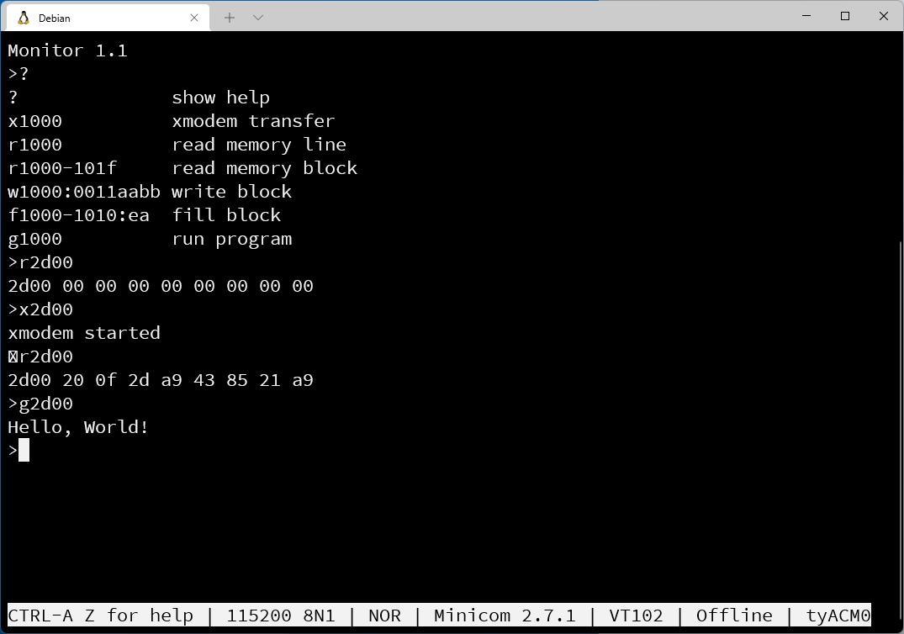

# 6502-cent1
A single board computer based on the W65C02S CPU.

## Features
- W65C02S running at 1 MHz
- 32K EEPROM
- 32K SRAM
- 2x VIA W65C22
- ACIA W65C51N
- Serial interface via RS232 DB9 or via USB
- Option to power via USB
- Minimal monitor with xmodem upload

## Demo
[This](examples/running_light.mp4) video shows the system in action.

## Schematics and PCB
- [PDF](kicad/schematics.pdf) of schematics
- See the KiCad project in folder [kicad](./kicad)  

## Jumpers
| JP1 | Function                                                      |
| --- | ------------------------------------------------------------- |
| Ext | powered from an external power supply (9V DC) connected to J1 |
| USB | powered from USB port                                         |

| JP2 + JP3 | Function                                          |
| --------- | ------------------------------------------------- |
| RS232     | serial connection via classic RS232 DB9 connector |
| USB       | serial connection via USB port *)                 |

*) The USB port implements a standard USB-to-Serial device.  
   It is based on the chip MCP2221 from Microchip Technology and works out of the box with Windows 10/11 and Linux.

## Connectors
  

## Software
All assembly programs must be built with [64tass](https://sourceforge.net/projects/tass64).

### Examples
- [running_light](./examples/running_light.asm)  
  outputs cyclic pattern on all VIA ports  
  see [video](examples/running_light.mp4)

- [acia_echo](./examples/acia_echo.asm)  
  echoes received character on serial port

### Enhanced BASIC  
downloads and patches source code with  [this](basic/build.sh) script

 
### Monitor
Simple [monitor](monitor/monitor.asm) program to upload and run a program using xmodem protocol.  

## Memory Map
| Address    | Device               |
| ---------- | -------------------- |
| $0000-7eff | RAM                  |
| $7f00-7f0f | VIA0                 |
| $7f10-7f1f | VIA1                 |
| $7f20-7f2f | ACIA                 |
| $7f30-7f3f | EXT (expansion port) |
| $7f40-7fff | unused               |
| $8000-ffff | ROM                  |

## Credits
Thanks to Ben Eater’s inspirational [videos](https://www.youtube.com/c/BenEater) and the work published by [Daryl Rictor](https://sbc.rictor.org).